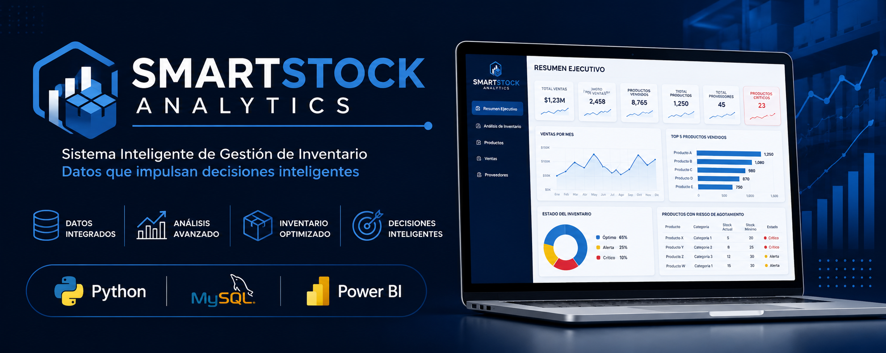
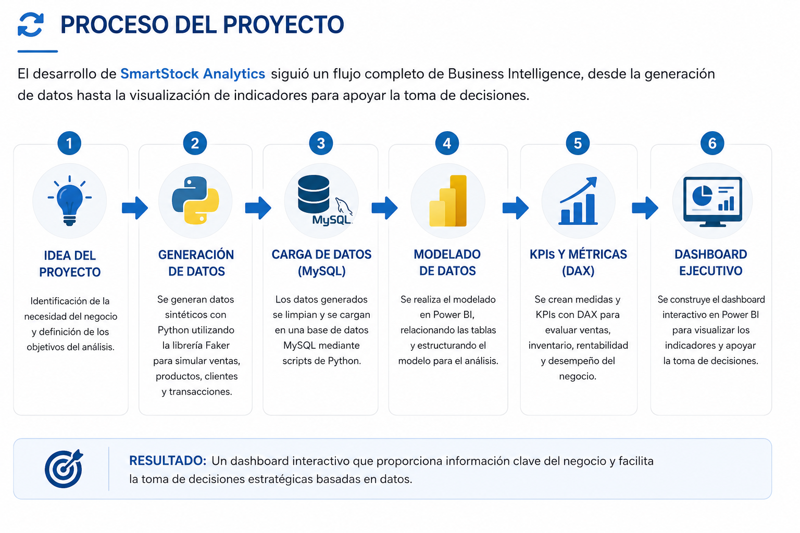
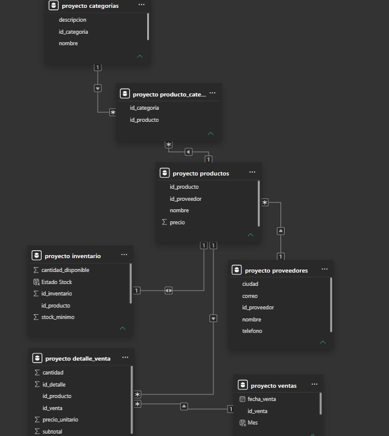
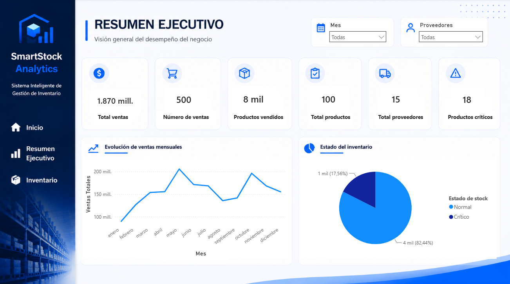
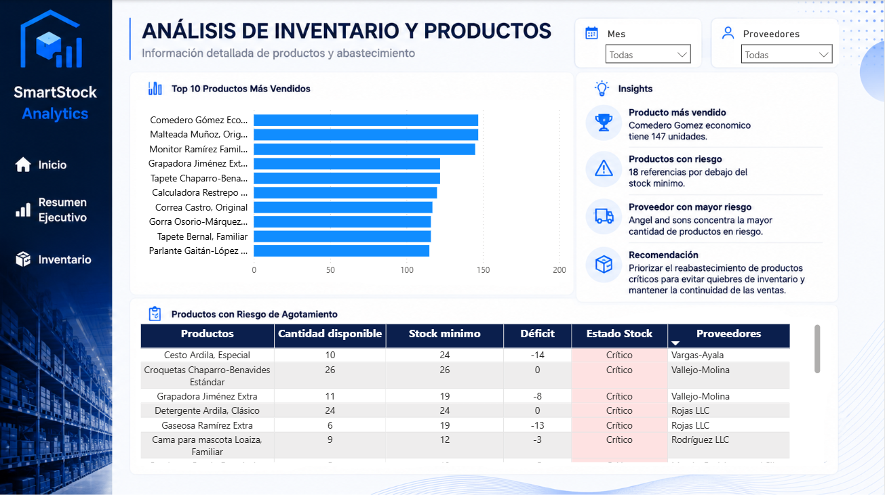

<p align="center">
  
</p>

<h1 align="center">📦 SmartStock Analytics</h1>

<p align="center">
<b>Sistema Inteligente de Gestión de Inventario mediante Business Intelligence</b>
</p>

<p align="center">
Dashboard interactivo desarrollado con Power BI, Python y MySQL para el análisis de ventas e inventario.
</p>

<p align="center">


</p>

---

# 📖 Descripción

**SmartStock Analytics** es un proyecto de **Business Intelligence** desarrollado para optimizar la gestión del inventario y apoyar la toma de decisiones en empresas del sector retail.

El proyecto implementa un flujo completo de análisis de datos:

- 🐍 Generación de datos simulados con **Python + Faker**
- 🗄️ Carga automática de datos en **MySQL**
- 📊 Modelado y visualización en **Power BI**
- 📈 Creación de KPIs mediante **DAX**

---

# 🎯 Objetivos

- 📦 Monitorear el inventario en tiempo real.
- 📈 Analizar el comportamiento de las ventas.
- ⚠ Detectar productos con riesgo de agotamiento.
- 📊 Centralizar la información del negocio.
- 🚀 Facilitar la toma de decisiones basada en datos.

---

# 🔄 Proceso del Proyecto

El desarrollo de **SmartStock Analytics** siguió un flujo completo de Business Intelligence, desde la generación de datos hasta la construcción de un dashboard interactivo para apoyar la toma de decisiones.

<p align="center">
  
</p>

---

# 🏗 Arquitectura de la Solución

```text
              Python + Faker
                     │
     Generación de datos simulados
                     │
                     ▼
              Base de Datos MySQL
                     │
                     ▼
      Modelado de Datos en Power BI
                     │
        KPIs • DAX • Visualizaciones
                     │
                     ▼
      Dashboard Ejecutivo Inteligente
```
# 🗃 Modelo Relacional

<p align="center">

</p>

---

# 📸 Dashboard

## 📊 Resumen Ejecutivo

<p align="center">

</p>

Indicadores principales del negocio:

- Total de ventas
- Productos vendidos
- Total de productos
- Total de proveedores
- Productos críticos
- Estado del inventario

---

## 📦 Análisis de Inventario

<p align="center">

</p>

Permite identificar:

- Top productos más vendidos
- Productos con riesgo de agotamiento
- Estado del inventario
- Tendencias de abastecimiento

---

# 📈 KPIs Implementados

| KPI | Objetivo |
|------|----------|
| 💰 Total de Ventas | Medir el volumen de ventas |
| 🛒 Número de Ventas | Control de transacciones |
| 📦 Productos Vendidos | Analizar demanda |
| 🏪 Total de Productos | Control del catálogo |
| 🚚 Total de Proveedores | Seguimiento de abastecimiento |
| ⚠ Productos Críticos | Detectar riesgo de desabastecimiento |

---

# 🚀 Funcionalidades

- Dashboard Ejecutivo
- Análisis de Inventario
- KPIs dinámicos
- Segmentadores interactivos
- Top productos vendidos
- Productos con riesgo de agotamiento
- Modelo relacional
- Business Intelligence
- Análisis visual de datos

---

# 🛠 Tecnologías Utilizadas

| Tecnología | Aplicación |
|------------|------------|
| 🐍 Python | Generación de datos con Faker y carga en MySQL |
| 🗄️ MySQL | Almacenamiento de datos |
| 📊 Power BI | Dashboard interactivo |
| 📈 DAX | KPIs y medidas analíticas |
| 📝 SQL | Consultas y modelado |
| 💻 Git & GitHub | Control de versiones |

---

# 📂 Estructura del Proyecto

```text
SmartStock-Analytics
│
├── Dashboard
│   └── SmartStock_Analytics.pbix
│
├── Python
│   ├── generar_datos.py
│   └── cargar_mysql.py
│
├── Database
│   └── modelo_relacional.png
│
├── Images
│   ├── banner.png
│   ├── logo.png
│   ├── resumen_ejecutivo.png
│   └── analisis_inventario.png
│
├── Presentation
│   └── SmartStock_Analytics.pdf
│
├── Documents
│
├── README.md
└── LICENSE
```

---

# 📊 Resultados Obtenidos

| Resultado | Estado |
|-----------|:------:|
| Dashboard interactivo | ✅ |
| Generación de datos con Python | ✅ |
| Integración Python → MySQL | ✅ |
| Modelo relacional | ✅ |
| KPIs con DAX | ✅ |
| Productos críticos identificados | ✅ |
| Análisis de inventario | ✅ |
| Visualización ejecutiva | ✅ |

---

# 🔮 Futuras Mejoras

- Publicación en Power BI Service.
- Actualización automática de datos.
- Pronóstico de demanda con Machine Learning.
- Alertas automáticas para productos críticos.
- Integración con APIs de inventario en tiempo real.

---

# 👨‍💻 Autor

## Luis Robles

**Ingeniero Electrónico | Analista de Datos**

📧 **Correo:** luissrb20@gmail.com

💼 **LinkedIn:** www.linkedin.com/in/luis-robles-rb

🌐 **GitHub:** https://github.com/RBluiss-16

---

<p align="center">

### ⭐ Si este proyecto fue de tu interés, no olvides darle una estrella al repositorio.

</p>
